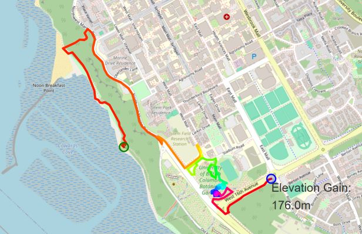
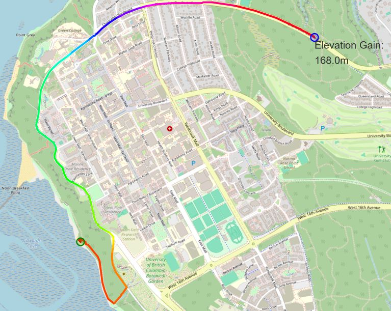

# Workout Plan with Depth First Search
## *CPSC 203 Project 3*

### Introduction
Leveraging open source structured map data from [OpenStreetMap](https://www.openstreetmap.org/), I developed an algorithm to plan a *workout route* (for running, biking, dog walking, etc.) with constraints in length, direction, and elevation gain. The algorithm executes depth first search by treating street maps as a graph with geolocated points as vertices and streets/paths as edges.

### Features
The project includes the following features:
1. Finding any path in the graph of a location of choice whose total distance is between 100% and 110% of a specified target length using depth first search.
2. Adding a constraint that we always take the "straightest" direction out of any vertex.
3. Reporting total elevation gain.
4. Providing a visualization of the route with the calculated elevation gain.

In the first task in the list above, the algorithm arbitrarily determines which direction it should go at every vertex. An example is in the image below where the route starts near Wreck beach and proceeds for at least 5000m but has a lot of turns.

In the second task, the algorithm is constrained to choose the outgoing direction at a vertex which is closest to the incoming direction. The image below shows the straight path it chose with the same inputs. 

### Schema
The script `routePlan.py` generates an interactive route visualization as the file `route_graph_workout.html` which can be opened on a browser. The script `load_map.py` generates a graphable map of the preferred location in a new `.gml` file. Note that this script may take a few minutes to complete as (a) it will likely download a fair amount of data and (b) the API is a little flakey so it sometimes takes multiple requests to get what is wanted. The script `routeFinding.py` defines important functions used in both `routePlan.py` and `load_map.py` files and therefore, must be run first.

**TL;DR** The order of running files is
- `routeFinding.py` that defines important functions used in other files
- `load_map.py` that generates a graphable map of the preferred location and saves it as `graph.gml`
- `routePlan.py` generates an interactive route visualization as the file `route_graph_workout.html`

### Result
The resulting workout route can be viewed by opening `route_graph_workout.html` on a browser.