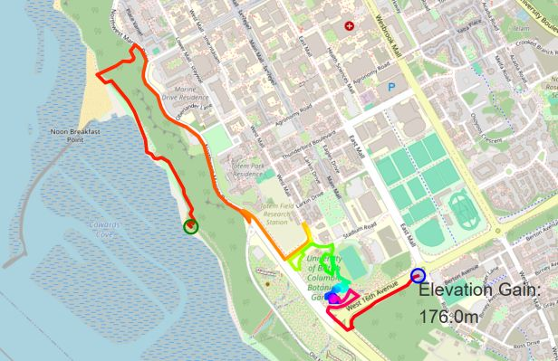
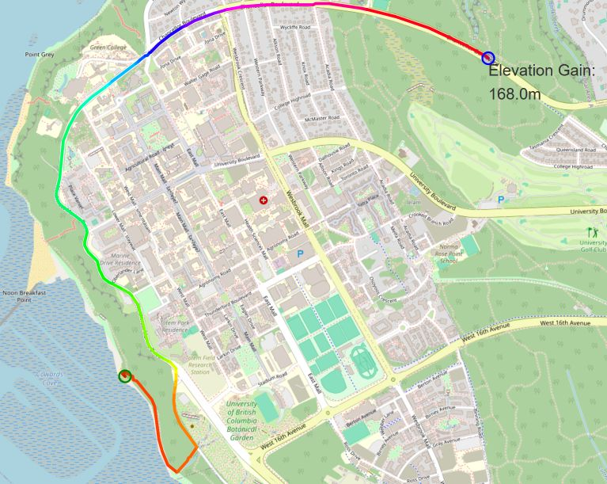

# Workout Plan with Depth First Search

### Introduction

Leveraging open source structured map data from [OpenStreetMap](https://www.openstreetmap.org/), I developed an algorithm to plan a *workout route* (for running, biking, dog walking, etc.) with constraints in length, direction, and elevation gain. The algorithm executes depth first search by treating street maps as a graph with geolocated points as vertices and streets/paths as edges.

### Features

The project includes the following features:

1. Finding any path in the graph of a location of choice whose total distance is between 100% and 110% of a specified target length using depth first search.
2. Adding a constraint that we always take the "straightest" direction out of any vertex.
3. Reporting total elevation gain.
4. Providing a visualization of the route with the calculated elevation gain.

In the first task in the list above, the algorithm arbitrarily determines which direction it should go at every vertex. An example is in the image below where the route starts near Wreck beach and proceeds for at least 5000m but has a lot of turns.

 \
*A workout route through UBC that makes a lot of turns*

In the second task, the algorithm is constrained to choose the outgoing direction at a vertex which is closest to the incoming direction. The image below shows the straight path it chose with the same inputs. 

 \
*A workout route through UBC that avoids turns*

### Schema

The script `routePlan.py` generates an interactive route visualization as the file `route_graph_workout.html` which can be opened on a browser. The script `load_map.py` generates a graphable map of the preferred location in a new `.gml` file. Note that this script may take a few minutes to complete as (a) it will likely download a fair amount of data and (b) the API is a little flakey so it sometimes takes multiple requests to get what is wanted. The script `routeFinding.py` defines important functions used in both `routePlan.py` and `load_map.py` files and therefore, must be run first.

**TL;DR** To generate a route, follow this order:

- `load_map.py` that generates a graphable map of the preferred location and saves it as `graph.gml`
- `routePlan.py` generates an interactive route visualization as the file `route_graph_workout.html`

*Note: `routeFinding.py` contains the core logic and must remain in the same directory as the other scripts so they can import its functions.*

### Usage

1. **Environment setup**

This project uses conda-lock to ensure dependency stability across Windows, macOS, and Linux. To create the environment, run the following in your bash terminal from the project root:

```bash
# install conda-lock
conda install -c conda-forge conda-lock

# generate project environment
conda-lock install -n workout-env conda-lock.yml
conda activate workout-env
```

2. **Running scripts**

You can execute the scripts (in order) through the following commands in your bash terminal from the project root:

```bash
# navigate to scripts directory
cd scripts

# execute the scripts
python load_map.py
python routePlan.py
```

3. **Viewing results**

After running the scripts, navigate to the `outputs/` folder and open `route_graph_workout.html` in any web browser to see the interactive map.

*Note: A `cache/` folder will be created automatically by OSMnx to speed up map loading. This folder is ignored by Git and can be deleted safely.*

*Note: Once you have viewed the project, you can return to your base environment by running `conda deactivate` in your bash terminal.*

### Resources

- [OSMnx documentation](https://osmnx.readthedocs.io/en/stable/osmnx.html)
- [NetworkX documentation](https://networkx.org/documentation/stable/reference/index.html)
